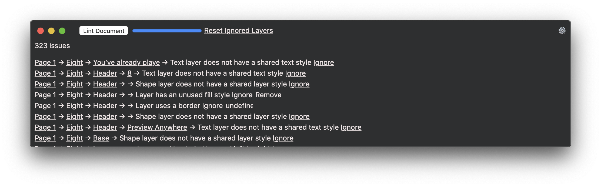

# slint

## What is Slint?
Slint is a linter for Sketch files. It analyzes your Sketch files and points out common issues (listed below). This is especially important for shared Sketch libraries that people collaborate on.

## Installation

- [Download](../../releases/latest/download/slint.sketchplugin.zip) the latest release of the plugin
- Un-zip
- Double-click on slint.sketchplugin
- You will find the menu entry "Slint" in the Plugins menu

## Rules
Read [the in-depth explanation](https://www.thoughtworks.com/insights/blog/pro-sketch-techniques-shared-libraries) on some of these rules.

Nr. | Name | Explanation
--- | ---- | -----------
1 | Page has a default name | All pages should be named semantically.
2 | Artboard has a default name | All artboards should be named semantically.
3 | Rectangle has a default name | All layers should be named semantically.
4 | Oval has a default name | All layers should be named semantically.
5 | Line has a default name | All layers should be named semantically.
6 | Image has a default name | All layers should be named semantically.
7 | Hotspot has a default name | All layers should be named semantically.
8 | Group has a default name | All groups should be named semantically.
9 | Symbol instance has a default name | All layers should be named semantically.
10 | Layer name contains 'Copy' | All layers should be named semantically. You can disable the 'Rename dublicate layers' setting in the preferences.
11 | Line found | Lines may result in sub-pixel placement which leads to blurry pixels. They also don't adjust well in resizing symbols. They should therefore be avoided and replaced by rectangles.
12 | Combined shape layer has a default name | All layers should be named semantically.
13 | Text layer has a default name | All layers should be named semantically.
14 | Layer style is out of sync with shared layer style | A layer's style should be managed centrally with a shared layer style and not deviate from it.'
15 | Shape layer does not have a shared layer style | A shape's style should be managed centrally with a shared layer style.
16 | Text layer does not have a shared text style | A text's style should be managed centrally with a shared text style.
17 | Text layer uses fill style | A text's color should be managed with a shared text style, not with a fill style.
18 | Layer uses a border | It is often advisable to use a combined shape of two rectangles, subtracted from one another, instead of layer borders. This avoids having to manage both fill styles and border styles.
19 | Layer has an unused border style | An unused border style might as well be removed completely.
20 | Layer has an unused fill style | An unused fill style might as well be removed completely.
21 | Layer has an unused shadow style | An unused shadow style might as well be removed completely.
22 | Layer has an unused inner shadow style | An unused inner shadow style might as well be removed completely.
23 | Symbol uses a background | Symbol background colors should be determined by a background layer.
24 | Superfluous group | A group that contains nothing but a group is superfluous and should be removed. If the group uses shadows or resizing constraints, those should be moved to the outer group.
25 | Empty group | A group that contains nothing is superfluous and should be removed.
26 | Unexportable icon | All icon symbols should be set to exportable so that they can be downloaded as assets in Abstract or Zeplin.
27 | Image in symbol | Images in symbols don't retain their aspect ratio when then symbol is resized. This leades to skewed images. Use rectangles with the fill type 'Pattern Fill' and paste the image in there instead.
28 | Master symbol override is not disabled | If you use a master symbol within a set of symbols to create variations of the master symbol, it is advised to disable the override of the master symbol in those variations.
29 | Text in symbol instance is not overridden | Since symbols are supposed to be reused multiple times, it is advisable to use placeholder text like 'Label' instead of example text that works in only one place.
30 | Hidden layer found | Hidden layers are often old stuff that should be removed entirely.
31 | Layers are not arranged top to bottom and left to right | Layers and artboards should be arranged in such a fashion that the top most layer in the layer list corresponds to the top left layer in the artboard. This is especially important for symbols because the overrides should appear in the symbol instance in a logical order.
32 | Symbol instance on Symbol page | There shouldn't be any instances of symbols on the Symbol page.
33 | Free-floating layer on page | All layers should be contained by an artboard.